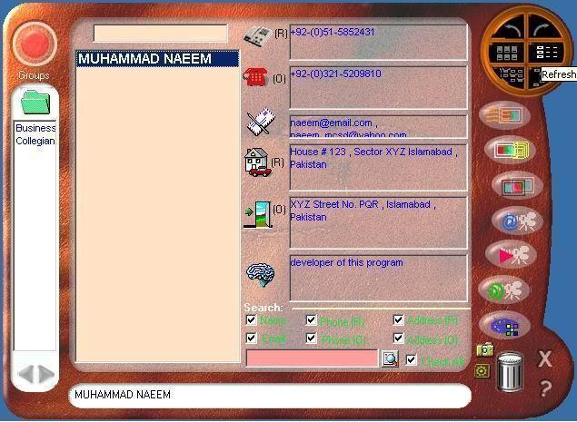



## Enterprise Manager

### Description

It is as suit of softwares.

1. Address Book

2. Quiz Master

3. Vocabulary Master

4. Schedular

5. Loan Calculator

Address Book

has following features

--&gt; A name with following attributes can be saved

i.	Name

ii.	Telephone (Res)

iii. Telephone (Off)

iv. Email

v. Address (Res)

vi. Address (Off)

vii. Comments

viii. Category (A single Addresse may belong to 0 to many categories)

Following Facilities are avilable in this system.

i. Add New Record

ii. Delete any / all record(s).

iii. Edit / Update partial / complete record

iv. Search over combination of any of attributes mentioned above

v. List Search (Binary Search) for fast searching using keyboard

vi. Navigation.

vii. Searching w.r.t. Category

viii. Category (Addition , Deletion , Updation)

ix. Counting of Record output in listbox.

x. Customizeable Options for changing / setting Font Size , Font Color , Background Colors of all of text outout controls.

xi. Convert (output) whole of selected record in two formats

1. Word 2000 / XP document file (.doc)

2. HTML format (.html)

In HTML format it can be customized in tabular / columnar style with preview option and customizeable setting of border size/color , font color of tables.

In word .doc format , a table is generated. This routine holds a variety of code so that it can be customized to fix page size setting , table setting , water marking etc.

xii. most important feature is its cool and nice user interface with glowing effects icons and transparent labesl controls (borderless or solid border)gives aesthetic look.

Schedular

Such a software was required to remember taks of daily life routines so that when a person sit at his/her PC, He can check pending jobs. (rather recalling from brain). This software can store any tasks along with priority and date. Later on when task has been accomplished, it can be moved into history.

It has cool user interface which was created from using Word clipart gallery (.wmf).

has a lot of options by which you can customize font size , font color , background color , font bold / italic etc. and also save them as your prefrence.

Vocabulary Master

This software is intended to build a Vocabulary pool. This pool of vocabulary is customizeable in terms of its edition / updation and addition. A slide show feature enables user of system to guess / test his/her vocabulary. This slide show is customizeable as time interval can be set along with visibility setting option of meaning of word.

Quiz Master

This software is infact a part of vocabulary Master software. It can be used for fast remembering of vocabulary. You just select All of words starting from A , B , C , D, &#8230;..Z or All . and it would create a large collection of words in memory. Now for against each word five meanings with one correct choice would be displayed. After making an exercise this software also track how many mistakes has been done so that only within mistakes area exercise can be repeated to cover that weak area.

All of trivial , niminal features has also been provided in software. Functionality of software is remarkably superb.

Loan Calculator

This software is intended to calculate full sheet detail of loan issued by bank to employees of various organization. Normally such loan schemes are intended to draw &#8216;n&#8217; times gross salary of an employees at a time. This Whole salary is returned on installments. This mathematics formula was needed to be formulated in terms of a software so that any one cab be provided with knowledge of options of total payable loan , installment , number of installments (period of loan return) and rate of interest.

Its inputs are Current Pay , Principal Amount (borrowed) , No of Salaries , Year for which loan is borrowed , Interest Rate. Current pay and principal both are mutually exclusive . It mean entry of only one of them is required other will be computed automatically.

Colored Progress Bar
 
### More Info
 
1. Address Book

2. Quiz Master

3. Vocabulary Master

4. Schedular

5. Loan Calculator

It is as suit of softwares.

1. Address Book

2. Quiz Master

3. Vocabulary Master

4. Schedular

5. Loan Calculator

Address Book

has following features

--&gt; A name with following attributes can be saved

i.	Name

ii.	Telephone (Res)

iii. Telephone (Off)

iv. Email

v. Address (Res)

vi. Address (Off)

vii. Comments

viii. Category (A single Addresse may belong to 0 to many categories)

Following Facilities are avilable in this system.

i. Add New Record

ii. Delete any / all record(s).

iii. Edit / Update partial / complete record

iv. Search over combination of any of attributes mentioned above

v. List Search (Binary Search) for fast searching using keyboard

vi. Navigation.

vii. Searching w.r.t. Category

viii. Category (Addition , Deletion , Updation)

ix. Counting of Record output in listbox.

x. Customizeable Options for changing / setting Font Size , Font Color , Background Colors of all of text outout controls.

xi. Convert (output) whole of selected record in two formats

1. Word 2000 / XP document file (.doc)

2. HTML format (.html)

In HTML format it can be customized in tabular / columnar style with preview option and customizeable setting of border size/color , font color of tables.

In word .doc format , a table is generated. This routine holds a variety of code so that it can be customized to fix page size setting , table setting , water marking etc.

xii. most important feature is its cool and nice user interface with glowing effects icons and transparent labesl controls (borderless or solid border)gives aesthetic look.

Schedular

Such a software was required to remember taks of daily life routines so that when a person sit at his/her PC, He can check pending jobs. (rather recalling from brain). This software can store any tasks along with priority and date. Later on when task has been accomplished, it can be moved into history.

It has cool user interface which was created from using Word clipart gallery (.wmf).

has a lot of options by which you can customize font size , font color , background color , font bold / italic etc. and also save them as your prefrence.

Vocabulary Master

This software is intended to build a Vocabulary pool. This pool of vocabulary is customizeable in terms of its edition / updation and addition. A slide show feature enables user of system to guess / test his/her vocabulary. This slide show is customizeable as time interval can be set along with visibility setting option of meaning of word.

Quiz Master

This software is infact a part of vocabulary Master software. It can be used for fast remembering of vocabulary. You just select All of words starting from A , B , C , D, &#8230;..Z or All . and it would create a large collection of words in memory. Now for against each word five meanings with one correct choice would be displayed. After making an exercise this software also track how many mistakes has been done so that only within mistakes area exercise can be repeated to cover that weak area.

All of trivial , niminal features has also been provided in software. Functionality of software is remarkably superb.

Loan Calculator

This software is intended to calculate full sheet detail of loan issued by bank to employees of various organization. Normally such loan schemes are intended to draw &#8216;n&#8217; times gross salary of an employees at a time. This Whole salary is returned on installments. This mathematics formula was needed to be formulated in terms of a software so that any one cab be provided with knowledge of options of total payable loan , installment , number of installments (period of loan return) and rate of interest.

Its inputs are Current Pay , Principal Amount (borrowed) , No of Salaries , Year for which loan is borrowed , Interest Rate. Current pay and principal both are mutually exclusive . It mean entry of only one of them is required other will be computed automatically.

Colored Progress Bar

No Side Effect

             |
---                |---
**Submitted On**   |2007-04-29 22:19:04
**By**             |[M\. Naeem](https://github.com/Planet-Source-Code/PSCIndex/blob/master/ByAuthor/m-naeem.md)
**Level**          |Advanced
**User Rating**    |5.0 (10 globes from 2 users)
**Compatibility**  |VB 6\.0
**Category**       |[Complete Applications](https://github.com/Planet-Source-Code/PSCIndex/blob/master/ByCategory/complete-applications__1-27.md)
**World**          |[Visual Basic](https://github.com/Planet-Source-Code/PSCIndex/blob/master/ByWorld/visual-basic.md)
**Archive File**   |[Enterprise206415552007\.zip](https://github.com/Planet-Source-Code/m-naeem-enterprise-manager__1-68526/archive/master.zip)

